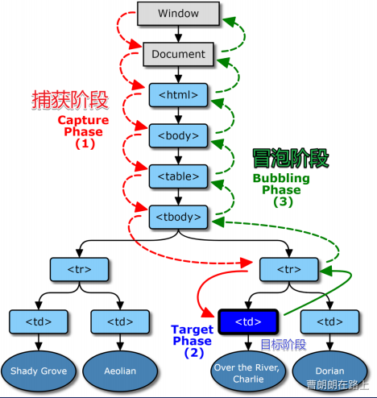
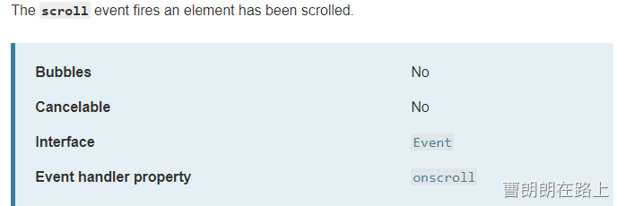

# DOM 事件机制&事件委托

## 一、事件机制

事件是在编程时系统内发生的动作或者发生的事情，系统会在事件出现的时候触发某种信号并且会提供一个自动加载某种动作的机制（来自MDN）。
每个事件都有事件处理器（有时也叫事件监听器），也就是触发事件时运行的代码块。严格来说事件监听器监听事件是否发生，然后事件处理器对事件做出反应。

## 二、DOM事件流

事件传播是一种机制，用于定义事件如何传播或通过DOM树传播，事件传播有两种方式：事件捕获(Capture)和事件冒泡(Bubble)。
事件传播形式上有三个阶段：

- 捕获阶段：从窗口进入事件目标阶段
- 目标阶段： 目标阶段
- 冒泡阶段：从事件目标回到窗口

但是，目标极端在现代浏览器中没有单独处理，所以当一个事件发生在具有父元素的元素上时，现代浏览器运行两个不同的阶段 - 捕获阶段和冒泡阶段。


## 三、事件捕获

事件发生时，在捕获阶段，事件从窗口向下通过DOM树传播到目标节点，即从最外层元素（祖先元素）触发事件响应函数，逐级往下，直到目标元素。（从外到内）
如果目标元素的任何祖先(即父、祖父等)和目标本身具有针对该类型事件专门注册的捕获事件侦听器，则这些侦听器将在捕获阶段执行。

## 四、事件冒泡

在事件冒泡阶段，正好相反。
事件冒泡模式流程：事件发生时，先触发目标元素（最直接元素）的事件响应函数，然后触发其父元素的事件响应函数，并逐级上溯到祖先元素。（从内到外）

## 五、W3C事件模型

因为有捕获和冒泡两种传播方式，W3C制定了一个标准可以让我们自己选择使用哪种传播方式`addEventListener('click',fn,?)`
第三个参数`?`是一个`bool`值，决定使用捕获或者冒泡。
当你`addEventListener`函数**第三个参数为`true`**时就表示你使用的是**事件捕获**。父级元素先触发，子级元素后触发。
当你`addEventListener`函数**第三个参数为空或为`false`**时就表示你使用的是**事件冒泡**。子级元素先触发，父级元素后触发。

## 六、target vs currentTarget

   e.target   用户操作的元素
   e.currentTarget    程序员监听的元素
   this是e.currentTarget，不推荐使用
例：
div>span{文字}，用户点击文字
e.target就是span
this是e.currentTarget就是div

## 七、阻止事件传播

在嵌套的元素中，并且每个元素都有事件处理程序时，当单击内部元素，所有处理程序都将同时执行，因为事件会出现在DOM树中。
**为了防止这种情况，可以使用**`**event.stopPropagation()**`**方法停止事件冒泡。**

```html
<div id="div1" style="border: 1px solid red; width: 100px; height: 100px;">
    <div id="div2" style="border: 1px solid blue; width: 50px; height: 50px;"></div>
</div>

<script>
hi.addEventListener("click", function(){
  console.log('div1')
});

hello.addEventListener("click", function(e){
  console.log('div2')
  e.stopPropagation()
});
</script>
```

因为在子元素点击事件中使用了`event.stopPropagation()`阻止冒泡事件，所以最终只打印出了目标元素`'div2'`，父元素的`'div1'`并没有被打印出。

## 八、阻止默认事件

有些事件具有与之关联的默认操作。例如点击一个链接浏览器带你到链接的目标，点击一个表单提交按钮浏览器提交表单等等。
可以使用事件对象的`preventDefault()`方法来防止此类默认操作。但是，阻止默认操作并不会停止事件传播，事件像往常一样继续传播到DOM树。

```html
<a id='div1' href='https://baidu.com'>点击跳转</a>
  
<script>
  a.addEventListener("click", function(e){
    e.preventDefault();
     }); 
</script>
```

我们给`a`添加点击事件，当用户点击`点击跳转`就阻止`a`标签的默认事件，所以点击后不会有跳转。

## 九、是否可以阻止冒泡

并不是所有事件都可以阻止冒泡的，具体可以`MDN`搜索`scroll event`，看到`Bubbles`和`Cancelable`
`Bubbles`的意思是该事件是否冒泡
`Cancelable`的意思是开发者是否可以阻止冒泡


### event.target & event.currentTarget

- **`e.target`** 指向事件触发的元素
- **`e.currentTarget`** 指向事件绑定的元素

## 十、事件委托

事件委托就是利用事件冒泡，只指定一个事件处理程序，就可以管理某一类型的所有事件。
事件委托：不监听元素 C 自身，而是监听其祖先元素 P，然后判断 e.target 是不是该元素 C（或该元素的子元素）
阻止默认动作：e.preventDefault() 或者 return false
阻止冒泡：e.stopPropagation()

### 优点

### 省监听数，减少内存消耗

```html
<div id="div1">
  <button>click 1</button>
  <button>click 2</button>
  <button>click 3</button>
  <button>click 4</button>
  <button>click 5</button>
</div>

<script>
div1.addEventListener('click', (e)=> { 
  //把目标元素赋给t
  const t = e.target
  // 判断是否匹配目标元素
  if (t.tagName.toLowerCase() === 'button') {
    console.log('button内容是:' + t.textContent);
  }
});
</script>
```

### 可以监听动态元素(不存在的元素)

```html
<div id="div1">
</div>
<script>
setTimeout(()=>{
  //div1里面添加一个button
  const button = document.creatElement('button')
  button.textContent = 'click 1'
  div1.appendChild(button)
},1000) 

  
div1.addEventListener('click',(e)=>{
const t=e.target
if (t.tagName.toLowerCase() ==='button'){
  console.log('button被click')
}
});  
</script>


```

### 封装事件委托

```html
<div id="div1">
</div>
<script>
setTimeout(()=>{
  const button = document.creatElement('button')
  button.textContent = 'click 1'
  div1.appendChild(button)
},1000) 

 on('click','#div1','button',()=>{
 console.log('button被点击了')
 })  
  
 function on(eventType, element, selector, fn){
   //判断如果element不是元素
   if(!(element instanceof Element)){
    element = document.querySelector(element)
   }
 element.addEventListener(eventType,(e)=>{
 const t = e.target
 //matches判断一个元素是否满足一个选择器
 if(t.matches(selector)){
    fn(e)
 }
 })
 }
</script>
```
