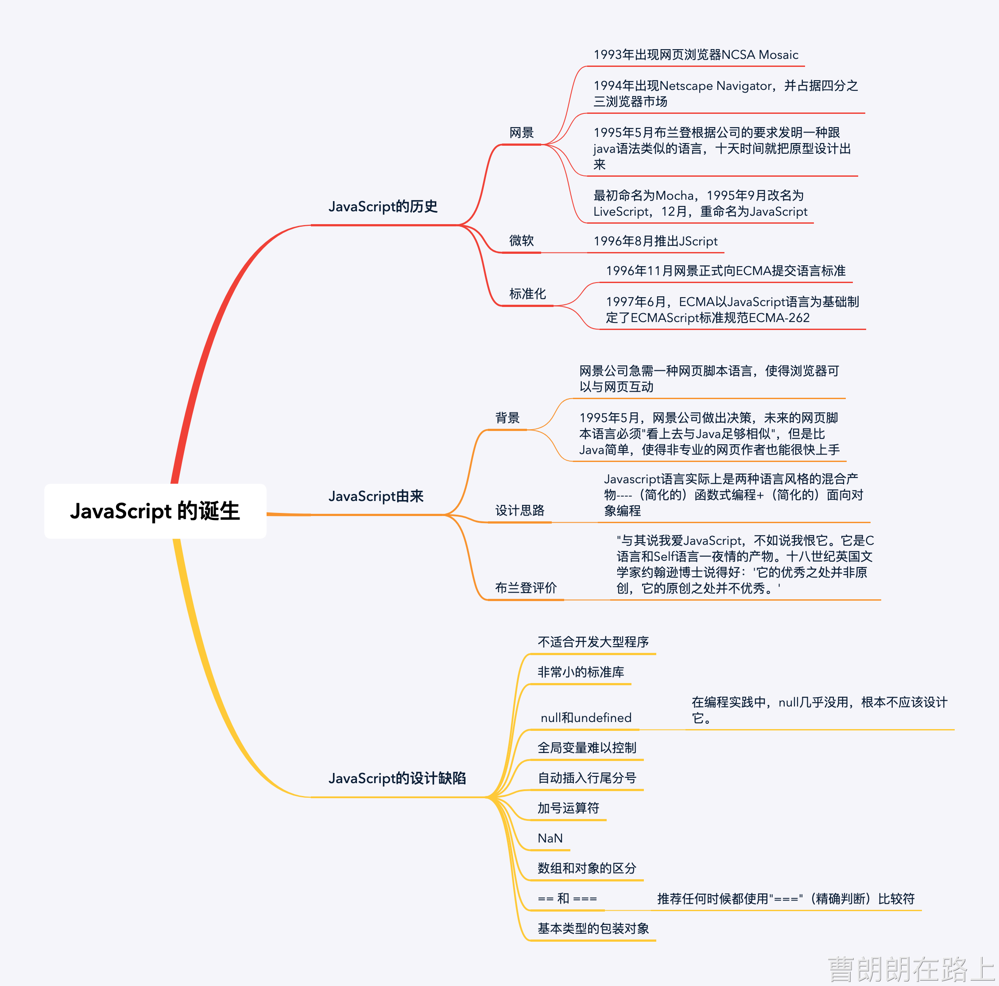

# JavaScript

  

## JavaScript的历史

### 网景

- 1993年出现网页浏览器NCSA Mosaic
- 1994年出现Netscape Navigator，并占据四分之三浏览器市场
- 1995年5月布兰登根据公司的要求发明一种跟java语法类似的语言，十天时间就把原型设计出来
- 最初命名为Mocha，1995年9月改名为LiveScript，12月，重命名为JavaScript

### 微软

- 1996年8月推出JScript

### 标准化

- 1996年11月网景正式向ECMA提交语言标准
- 1997年6月，ECMA以JavaScript语言为基础制定了ECMAScript标准规范ECMA-262

## JavaScript由来

### 背景

- 网景公司急需一种网页脚本语言，使得浏览器可以与网页互动
- 1995年5月，网景公司做出决策，未来的网页脚本语言必须"看上去与Java足够相似"，但是比Java简单，使得非专业的网页作者也能很快上手

### 设计思路

> Javascript语言实际上是两种语言风格的混合产物----（简化的）函数式编程+（简化的）面向对象编程

### 布兰登评价

> "与其说我爱JavaScript，不如说我恨它。它是C语言和Self语言一晚上的产物。十八世纪英国文学家约翰逊博士说得好：'它的优秀之处并非原创，它的原创之处并不优秀。'

## JavaScript的设计缺陷

### 不适合开发大型程序

### 非常小的标准库

### null和undefined

> 在编程实践中，null几乎没用，根本不应该设计它。

### 全局变量难以控制

### 自动插入行尾分号

### 加号运算符

### NaN

### 数组和对象的区分

### == 和 ===

> 推荐任何时候都使用"==="（精确判断）比较符

### 基本类型的包装对象

## 链接

### <a href="http://www.ruanyifeng.com/blog/2011/06/birth_of_javascript.html" target="_blank">Javascript诞生记</a>

### <a href="http://www.ruanyifeng.com/blog/2011/06/10_design_defects_in_javascript.html" target="_blank">Javascript的10个设计缺陷</a>
