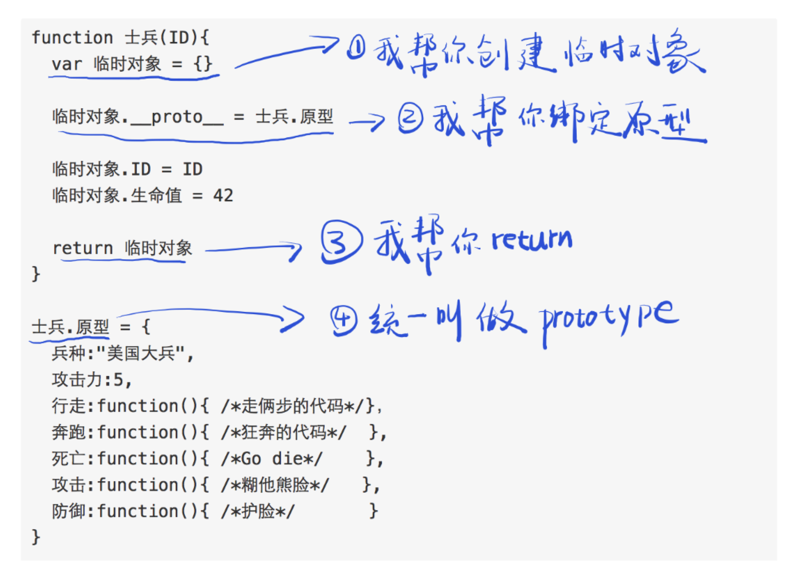

# JS的new做了什么
1. 创建临时对象/新对象
2. 绑定原型
3. 指定 this = 临时对象
4. 执行构造函数
5. 返回临时对象



```javascript
function 士兵(ID){
  this.ID = ID
  this.生命值 = 42
}

士兵.prototype = {
  兵种:"美国大兵",
  攻击力:5,
  行走:function(){ /*走俩步的代码*/},
  奔跑:function(){ /*狂奔的代码*/  },
  死亡:function(){ /*Go die*/    },
  攻击:function(){ /*糊他熊脸*/   },
  防御:function(){ /*护脸*/       }
}

// 保存为文件：士兵.js
```
```javascript
var 士兵们 = []
for(var i=0; i<100; i++){
  士兵们.push(new 士兵(i))
}

兵营.批量制造(士兵们)
```
> new 的作用，就是省那么几行代码。（也就是所谓的语法糖）注意 constructor 属性

<br />
<a href="https://zhuanlan.zhihu.com/p/23987456" target="_blank">原文链接</a>
