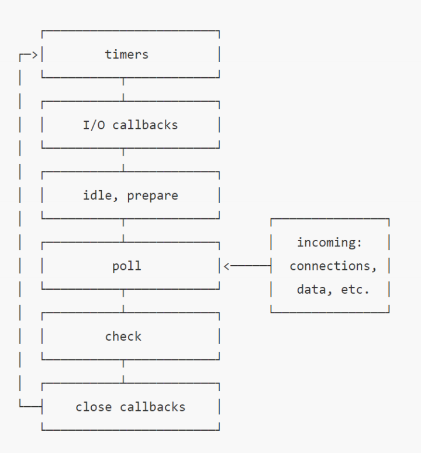

# Event Loop

## Event Loop是什么

### 什么是Event

1. 计时器到期了
2. 文件可以读取了， 读取出错了
3. socket有内容了，关闭了

### 什么是Loop

1. loop 就是循环
2. 由于事件是分优先级的，所以处理起来也是分先后的
3. 所以Node.js需要按顺序轮询每种事件
4. 这种轮询往往都是循环的

### Event Loop

操作系统可以粗发事件，JS 可以处理事件
Event Loop 就是对事件处理顺序的管理

## 顺序示意图

## 

### 重要阶段

timers 检查计时器
poll轮询，检查事件系统
check 检查 setImmediate 回调
其他阶段用的较少

### 注意

大部分时间，Node.js都停在 poll 轮询阶段
大部分时间都在poll阶段被处理，如文件，网络请求
