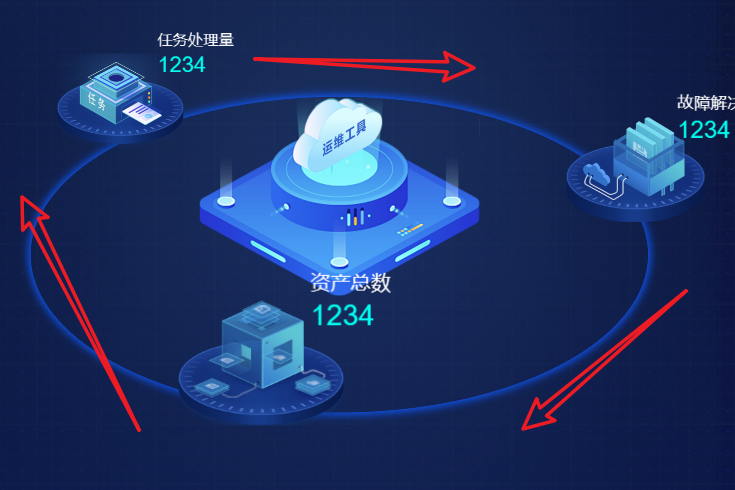

## 旋转

### 效果图



### 代码

```vue
<template>
  <div class="top-circle">
    <div class="lopp">
      
    </div>
    <div class="ball ball1">
      <div class="item">
        
        <div class="num">
          <div>资产总数</div>
          <div>1234</div>
        </div>
      </div>
    </div>
    <div class="ball ball2">
      <div class="item">
        
        <div class="num">
          <div>任务处理量</div>
          <div>1234</div>
        </div>
      </div>
    </div>
    <div class="ball ball3">
      <div class="item">
        
        <div class="num">
          <div>故障解决量</div>
          <div>1234</div>
        </div>
      </div>
    </div>
  </div>
</template>
<script></script>
<style lang="less" scoped>
@keyframes animX {
  0% {
    left: 0;
  }
  100% {
    left: 33vw;
  }
}
@keyframes animY {
  0% {
    top: 0;
  }
  100% {
    top: 30vh;
  }
}
@keyframes scale {
  0% {
    transform: scale(1);
  }
  25% {
    transform: scale(1.25);
  }
  50% {
    transform: scale(1.5);
  }
  75% {
    transform: scale(1.25);
  }
  100% {
    transform: scale(1);
  }
}
.top-circle {
  height: 50vh;
  position: relative;
  .lopp {
    width: 33vw;
    height: 30vh;
    border: 1px solid #0f52e7;
    box-shadow: 0 0 8px 2px #0f52e7;
    border-radius: 50%;
    position: absolute;
    left: 3vw;
    top: 8vh;
    display: flex;
    justify-content: center;
    // align-items: center;
    > img {
      width: 15vw;
      height: 19vh;
    }
  }
  .ball {
    position: absolute;
    color: #fff;
    font-size: 22px;
    display: flex;
    align-items: center;
    justify-content: center;
    .item {
      position: relative;
      > img {
        width: 6vw;
        height: 8vh;
      }
      .num {
        position: absolute;
        bottom: 6.5vh;
        left: 8.5vh;
        width: 10vh;
        > div {
          &:nth-child(1) {
            font-size: 14px;
            color: #ffffff;
            display: block;
          }
          &:nth-child(2) {
            margin-top: 3px;
            font-size: 20px;
            font-family: Arial;
            font-weight: 400;
            color: #00fff0;
            display: block;
            > span {
              font-size: 12px;
              color: #00fff0;
            }
          }
        }
      }
    }
  }
  // 3个div, x和y轴动画加起来是20s , 20s/3 约等于 6.667s
  // 每个div, y轴动画延迟 从0递减6.667s,x轴与y相差动画时长的一半（10s/2）
  .ball1 {
    animation: animX 10s cubic-bezier(0.36, 0, 0.64, 1) -5s infinite alternate,
      animY 10s cubic-bezier(0.36, 0, 0.64, 1) 0s infinite alternate,
      scale 20s cubic-bezier(0.36, 0, 0.64, 1) 0s infinite alternate;
  }
  .ball2 {
    animation: animX 10s cubic-bezier(0.36, 0, 0.64, 1) -11.667s infinite alternate,
      animY 10s cubic-bezier(0.36, 0, 0.64, 1) -6.667s infinite alternate,
      scale 20s cubic-bezier(0.36, 0, 0.64, 1) -6.667s infinite alternate;
  }
  .ball3 {
    animation: animX 10s cubic-bezier(0.36, 0, 0.64, 1) -18.334s infinite alternate,
      animY 10s cubic-bezier(0.36, 0, 0.64, 1) -13.334s infinite alternate,
      scale 20s cubic-bezier(0.36, 0, 0.64, 1) -13.334s infinite alternate;
  }
}
</style>

```

## 数字

### 效果图


```javascript
<template>
  <div class="asset-num" v-loading="loading">
    <h3 class="title">资产总数</h3>
    <div class="box-item">
      <li v-for="(item, index) in orderNum" class="number-item" :key="index">
        <span>
          <i ref="numberItem">0123456789</i>
        </span>
      </li>
    </div>
  </div>
</template>

<script>
export default {
  data() {
    return {
      loading: false,
      orderNum: ["1", "2", "0", "0", "5", "0", "0"],
      count: 100,
    };
  },
  methods: {
    setNumberTransform() {
      const numberItems = this.$refs.numberItem; // 拿到数字的ref，计算元素数量
      const numberArr = this.orderNum.filter((item) => !isNaN(item));
      // 结合CSS 对数字字符进行滚动,显示订单数量
      for (let index = 0; index < numberItems.length; index++) {
        const elem = numberItems[index];
        elem.style.transform = `translate(-50%, -${numberArr[index] * 10}%)`;
      }
    },
    toOrderNum(num) {
      num = num.toString();
      if (num.length < 7) {
        num = "0" + num; // 如未满八位数，添加"0"补位
        this.toOrderNum(num); // 递归添加"0"补位
      } else if (num.length === 7) {
        num = num.slice(0, 2) + num.slice(2, 5) + num.slice(5, 7);
        this.orderNum = num.split(""); // 将其便变成数据，渲染至滚动数组
      } else {
        this.$message.warning("订单总量数字过大，显示异常");
      }
    },
    increaseNumber() {
      let self = this;
      this.timer = setInterval(() => {
        self.count = self.count + this.getRandomNumber(1, 100);
        this.toOrderNum(self.count);
        this.$nextTick(() => {
          self.setNumberTransform(self.count);
        });
      }, 3000);
    },
    getRandomNumber(min, max) {
      return Math.floor(Math.random() * (max - min + 1) + min);
      //随机生成
    },
  },
  mounted() {
    // this.increaseNumber();
    this.setNumberTransform()
  },
};
</script>

<style lang="scss">
.asset-num {
  display: flex;
  // justify-content: space-between;
  align-items: center;
  .title {
    color: #fff;
    font-size: 18px;
    font-weight: bolder;
    padding: 0 1.5vw;
  }
  .box-item {
    .number-item {
      margin: 0 0.5vw;
      width: 3vw;
      height: 7vh;
      background: no-repeat url("../../../../asset/image/screen/numbj.png");
      background-size: 100% 100%;
      color: #fff;
      list-style: none;
      display: inline-block;
      font-size: 6vh;
      & > span {
        position: relative;
        display: inline-block;
        margin-right: 10px;
        width: 100%;
        height: 100%;
        writing-mode: vertical-rl;
        text-orientation: upright;
        overflow: hidden;
        & > i {
          font-style: normal;
          position: absolute;
          top: -.8vh;
          left: 50%;
          transform: translate(-50%, 0);
          transition: transform 1s ease-in-out;
          letter-spacing: 10px;
        }
      }
      &:last-child {
        margin-right: 0;
      }
    }
  }
}
</style>

```
