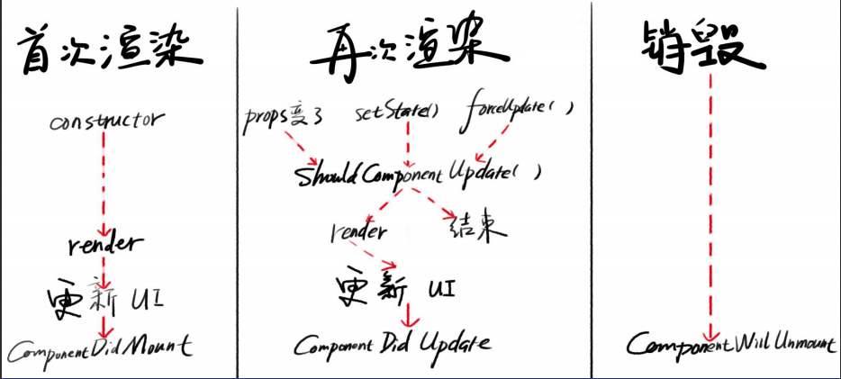

# React Class组件详解

## 两种方式创建Class组件

### ES5方式（过时仅作了解）

```jsx
import React from 'react'
const A = React.createClass({
render() {
return (
<div>hi</div>
)
}
})
export default A
//由于ES5不支持class 所以才有这种方式
```

### ES6方式（主要用这个）

```jsx
import React from 'react';

class B extends React.Component{
    constructor(props){
      super(peops);
    }
  render(){
    return (
    <div>hi</div>
    )
}
}
export default B;
// extends constructor super 强行记忆
```

## Props 外部数据

### 初始化

```jsx
class B extends React.Component{
 constructor(props){
    super(props);
 }
  render(){}
}
// 不初始化可以省略 constructor ；如果需要初始化的话就必须写全套 
```

### 效果

- 这么做了之后， `this.props` 就是外部数据对象的地址了

### 读

- 通过 `this.props.xxx`  来读

### 写

- 外部数据应该由外部数据来更新

### 相关钩子(已经被弃用了，不要用 ，了解）

- componentWillReceiveProps
- 当组件接受新的props时会触发此钩子
- 更名为 UNSAFE_componentWillReceiveProps

### Props的作用

接受外部数据：只能读不能写；外部数据由父组件传递
接受外部函数：在恰当的时机，调用该函数；该函数一般是父组件的函数

## State & setState 内部数据

### 初始化 State

```jsx
class B extends React.Compoment{
 constructor(props){
   super(props);
//初始化
   this.state ={
        user: {name:just, age:18}
   }
 }
  render(){/*...*/}
}
```

### 读写 State

#### 读用 `this.state`

`this.state.xxx.yyy`

**写用**`**this.setState(???,fn)**`****
`this.setState(newState,fn)`
注意：setState 不会立刻改变 this.state， 会在当前代码运行完后再更新this.state 从而触发UI更新
函数形式：`this.setState((state,props)=>newState,fn)`
这种方式的 state 更易于理解
fn是成功的回调，在写入成功后执行。（用的比较少）

```javascript
//this.setState(newState,fn)
this.setState({x: this.state.x + 1 })
//this.setState((state,props)=>newState,fn)
this.setState((state)=>({x: state.x + 1}))
```

#### 写时会 shallow mergfe

自动合并
setState 会自动将新 state 与旧 state 进行一级合并，可以用 `...this.state` 全部合并

## 生命周期

### 函数列表

- constructor() - 在这里初始化 state
- shouldComponentUpdate() - return false 阻止更新
- render() - 创建虚拟 DOM
- componentDidMount() - 组件已出现在页面
- componentDidUpdate() - 组件已更新
- componentWillUnmount() - 组件将死

### constructor

#### 用途

- 初始化 props
- 初始化state， 但此时不能调用 setState
- 用来写 bind this

```jsx
constructor(){
    /*其他代码忽略*/
  this.onClick = this.onClick.bind(this)
}
//可以用新语法代替  注意下面这个是写在外面的
onClick = ()=>{}
constructor(){/*...*/}
```

constructor 如果只初始化 props可不写 如果要初始化 state 就必须写全

### shouldComponentUpdate

#### 用途

返回 true 表示不阻止 UI 更新
返回 false 表示阻止 UI 更新

### 启发

其实可以将 newState 和 this.state 的每个属性都对比一下 如果全都相等，就不更新
如果有一个不等，就更新（对比的时候只对比一层 ，浅对比）
React 内置了这个功能 叫做 `React.PureComponent` 可以代替 `React.Component`

### render

#### 用途

- 展示视图

`return (<div>...</div>)`

- 只能有一个根元素
- 如果有两个根元素，就要用<React.Fragment>包起来
- <React.Fragment/> 可以缩写成 <></>

#### 技巧

- render 里面可以写  `if...else`
- render 里面可以写 ?: 表达式
- render 里面不能直接写 for 循环，需要用数组
- render 里面可以写 `array.map` (循环）

### componentDidMount()

#### 用途

- 在元素插入页面后执行代码，这代码依赖DOM(在元素出现后才能执行的操作)
- 比如你想获取 div 的高度，就最好在这里写
- 此处可以发起加载数据的 AJAX 请求（官方推荐）
- 首次渲染会执行此钩子

#### 参数

看文档

### componentDidUpdate()

#### 用途

- 在视图更新后执行代码
- 此处也可以发起AJAX请求， 用于更新数据（看文档）
- 首次渲染不会执行此钩子
- 在此处 setState 可能会引起无限循环，除非放在 if 里（因为变了所以会不停的更新）
- 若 shouldCom..Update返回 false, 则不触发此钩子

#### 参数

看文档

### componentWillUnmount

#### 用途

组件将要被移出页面然后被销毁时执行代码
unmount 过的组件不会再次 mount

#### 举例

你在 c..DidMount 里面创建 就要在 c..WillUnmount里面取消
原则：谁污染谁治理

### 分阶段看钩子执行顺序



## React.PureComponent

PureComponent 会在 render 之前对比新 state 和旧 state 的每一个 key，以及新 props 和旧 props 的每一个 key。
如果所有 key 的值全都一样，就不会 render；如果有任何一个 key 的值不同，就会 render。
