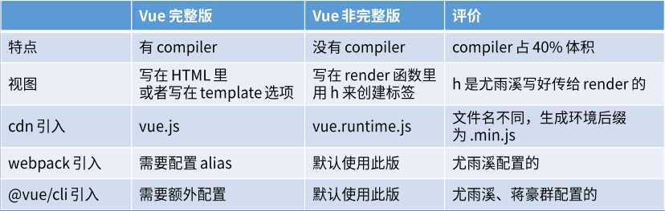

# Hello,Vue

## Vue版本



### [Vue完整版](https://cn.vuejs.org/index.html)

1. 有编译器compiler，体积大功能多，可以直接把html字符串变成DOM节点
2. 视图，此处为html字符串，写在index.html里或者写在`new Vue`构造选项template里
3. 引入方法

- cdn引入：在index.html里用`script`标签引入，bootcdn：vue.min.js(无注释的完整版)
- webpack引入：需要配置alias（详见官方文档）
- @vue/cli引入：需要额外配置（详见官方文档）

### [Vue非完整版](https://cli.vuejs.org/zh/)

1. 无编译器compiler，体积小功能少了点
2. 视图，只能自己在`new Vue`里写构造选项render函数里，用h来创建标签
3. 引入方法

- cdn引入：在index.html里用`script`标签引入，bootcdn：vue.runtime.min.js(无注释的非完整版)
- webpack引入：默认使用非完整版的
- @vue/cli引入：默认使用非完整版的

#### Vue单文件组件

- 在webpack打包时，vue-loader可以把vue文件翻译成带有render函数的一个对象，这样在main.js里引用就行了，就不用我们自己去写render函数了
- 整个vue文件被翻译成一个对象
- vue文件里的template里的html字符串被翻译成非完整版需要的render函数。

#### 非完整版好处

1. 保证用户体验，用户下载的JS文件体积更小，但只支持render函数
2. 开发者可直接在vue文件里写HTML标签，而不需要写render函数
3. 因为可以用vue-loader 把vue文件里的HTML转为render函数

### template

在index.html里引入run.runtime.min.js
新建vue文件Demo.vue

```javascript
//在Demo.vue里
<template>                  //在vue文件Demo.vue里的template里写html字符串
  <div id="app">
    {{n}}
    <button @click="add">+1</button>
  </div>
</template>

<script>
import HelloWorld from "./components/HelloWorld.vue";

export default {
  name: "App",
  data() {
    return { n: 0 };
  },
  methods: {
    add() {
      this.n += 1;
    }
  }
};
</script>

<style>
</style>


```

## render

 ```javascript

//在main.js里
import Vue from "vue";
import Demo from "./Demo.vue";//引入vue文件Demo.vue
import { render } from "sass";

Vue.config.productionTip = false;

new Vue({
  el: "#app",
  render(h) {
    return h(Demo);   //这样用
  }
});

```

之后预览时，vue-loader就可以进行转换了

## [codesandbox.io](https://codesandbox.io/s/)

进入网站，选Vue,然后就可以正常使用了
